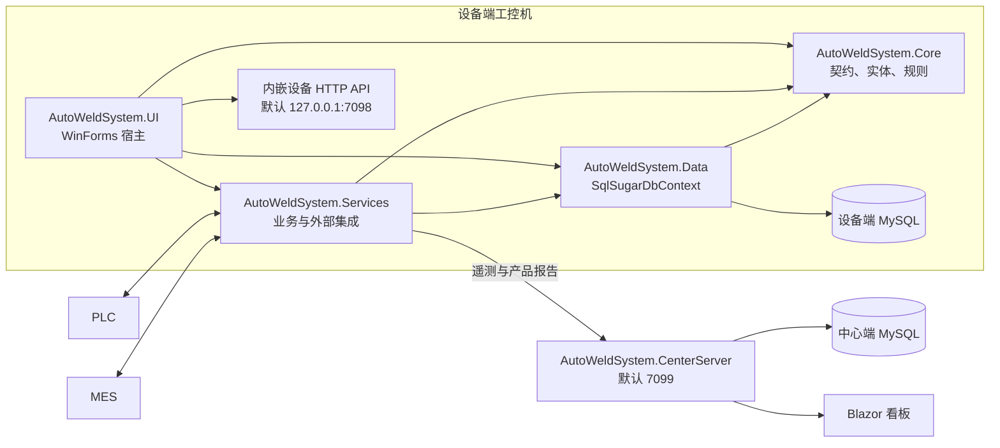
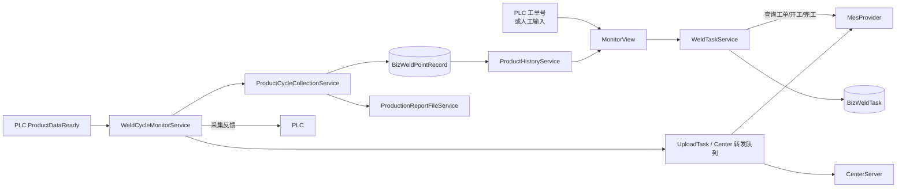

# AutoWeldSystem 项目快速理解指南

> 面向第一次接手本仓库的开发者。核对日期：2026-07-21。本文描述当前实现，不代表理想架构；代码和项目文件始终是最终事实来源。

## 1. 一句话认识项目

AutoWeldSystem 是一套运行在 Windows 工控机上的 .NET 8 WinForms 上位机。它负责连接 PLC、MES 和 MySQL，编排工单、程序、配方、焊点采集、报表及补传；仓库中还包含一个可独立部署的中心服务器，用于汇总多台设备的状态和产品报告。

系统不是单一桌面程序，而是两个可运行进程加一套共享类库：

- `AutoWeldSystem.UI`：设备端 WinForms 主程序，也是 PLC/MES/生产流程的运行宿主。
- `AutoWeldSystem.CenterServer`：独立的 ASP.NET Core/Blazor 中心服务。
- `Core`、`Data`：两个进程共享的模型、规则和数据库实现；`Services` 主要由设备端 UI 使用。
- `AutoWeldSystem.Tests`：自包含的控制台回归测试入口，不是常规 xUnit/NUnit 项目。

当前程序集版本以 `Directory.Build.props` 为准，为 `1.0.7`；`README.md` 中的旧版本号可能未同步。

## 2. 建议的 10 分钟阅读顺序

1. 看 `AutoWeldSystem.sln` 和各项目的 `*.csproj`，先确认真实引用方向。
2. 看 `AutoWeldSystem.UI/Program.cs`，理解依赖注入、后台服务启动顺序和登录循环。
3. 看 `AutoWeldSystem.Services/Production/WeldTaskService.cs`，理解工单、开工、完工及运行时状态。
4. 看 `AutoWeldSystem.Services/Plc/WeldCycleMonitorService.cs`，理解 PLC 如何触发产品采集。
5. 最后看 `AutoWeldSystem.UI/Views/MonitorView.cs`。它是界面编排中心，但文件很大，不适合作为第一入口。

## 3. 运行拓扑



关键点：

- UI 进程同时承担 WinForms 界面、依赖注入容器、后台轮询服务和一个内嵌 ASP.NET Core HTTP 服务。
- PLC/MES/中心同步并不是 `IHostedService`。`Program.cs` 显式按顺序调用各服务的 `StartAsync` 和 `StopAsync`。
- 设备端业务以本地数据库为可靠落点。网络不可用时，生产记录和上传任务先落库，再由后台流程补传。

## 4. 六个项目与类库关系

下图箭头表示“编译期直接引用”。当前没有项目引用环。

```mermaid
flowchart TD
    TESTS[AutoWeldSystem.Tests<br/>Exe / net8.0] --> CENTER[AutoWeldSystem.CenterServer<br/>Exe (Web SDK) / net8.0]
    TESTS --> SERVICES[AutoWeldSystem.Services<br/>Library / net8.0]
    TESTS --> CORE[AutoWeldSystem.Core<br/>Library / net8.0]

    UI[AutoWeldSystem.UI<br/>WinExe / net8.0-windows] --> SERVICES
    UI --> DATA[AutoWeldSystem.Data<br/>Library / net8.0]
    UI --> CORE

    CENTER --> DATA
    CENTER --> CORE
    SERVICES --> DATA
    SERVICES --> CORE
    DATA --> CORE
```

| 项目 | 当前职责 | 直接项目引用 | 关键依赖/入口 |
| --- | --- | --- | --- |
| `AutoWeldSystem.Core` | 实体、DTO、接口、常量、纯规则、运行时状态、本地化资源 | 无 | `SqlSugarCore 5.1.4.214` |
| `AutoWeldSystem.Data` | 创建 `SqlSugarScope`，MySQL CodeFirst 建库建表 | `Core` | `SqlSugarDbContext.cs` |
| `AutoWeldSystem.Services` | 业务服务、PLC/MES/中心集成、日志、上传和报表 | `Core`、`Data` | `ClosedXML 0.104.2`、本地 `HslCommunication.dll` |
| `AutoWeldSystem.UI` | WinForms 页面、应用启动、DI、设备端内嵌 HTTP API | `Core`、`Data`、`Services` | `Program.cs`、AntdUI、Hosting、`Microsoft.AspNetCore.App` |
| `AutoWeldSystem.CenterServer` | 中心 API、状态入库、Excel 报告、SignalR、Blazor 看板 | `Core`、`Data` | `Program.cs`、ClosedXML、Serilog |
| `AutoWeldSystem.Tests` | 控制台回归测试和少量端到端文件测试 | `CenterServer`、`Core`、`Services` | `Program.cs` |

`AutoWeldSystem.Libs` 不是项目，目前只保存 Services 使用的 `HslCommunication.dll`。

### 4.1 Core 里放了什么

| 目录 | 内容 | 常见使用者 |
| --- | --- | --- |
| `Constants`、`Enums`、`Exceptions` | 全局约定、状态值和业务异常 | 全部项目 |
| `Entities` | SqlSugar 数据库实体 | Data、Services、CenterServer |
| `DTOs` | MES、PLC、中心服务、上传等传输模型 | Services、UI、CenterServer |
| `Interfaces` | 服务契约和事件契约 | UI、Services |
| `Production`、`Plc`、`Mes`、`Center`、`Security` | 可独立测试的规则和映射 | Services、Tests |
| `Runtime` | 多工位运行状态和设置变更快照 | Services、UI |
| `ViewModels` | 跨层展示快照 | Services、UI |
| `Localization` | 中英文资源 | Services、UI |

注意：Core 不是完全“零外部依赖”的领域层。实体直接使用 `[SugarTable]`、`[SugarColumn]`，所以 Core 明确依赖 SqlSugar。旧架构评审中“Core 无外部依赖”的描述已经过时。

### 4.2 Services 的功能分区

| 目录 | 主要职责 | 代表类 |
| --- | --- | --- |
| 根目录 | 设置、用户/RBAC、本地化、程序版本与 MES 同步 | `AppSettingsService`、`SysUserService`、`ProgramManageService` |
| `Plc` | HSL 通信、逻辑地址、心跳、工单/生产/焊接/配方轮询 | `CommunicationService`、`WeldCycleMonitorService` |
| `Mes` | MES HTTP 请求和连接状态探测 | `MesProvider`、`MesConnectionMonitor` |
| `Production` | 生产用例、采集、历史、报表、上传任务和设备状态 | `WeldTaskService`、`ProductCycleCollectionService`、`UploadTaskService` |
| `Center` | 设备向中心端发送遥测和产品报告 | `CenterTelemetrySyncService`、`CenterProductForwardingService` |
| `Log` | 操作、MES 交互、生产流程、异常和设备生命周期日志 | `OperationLogService`、`ProgramExceptionLogService` |

## 5. UI 进程如何启动

`AutoWeldSystem.UI/Program.cs` 是最重要的组合根，流程如下：

1. 初始化 WinForms，并设置全局未处理异常捕获。
2. 用 `Host.CreateDefaultBuilder()` 创建配置和 DI 容器。
3. 注册单例数据库上下文、业务服务、PLC/MES 监控、日志、上传和中心同步服务。
4. 注册 typed `HttpClient`；窗体和页面注册为 transient。
5. 调用 `ISysUserService.InitDb()`：CodeFirst 建库建表，初始化角色、权限和种子用户。
6. 显式启动设备 HTTP API、PLC 连接、MES 连接监控、PLC 生产/工单/焊接/配方监控、实时预览、中心同步和生命周期日志。
7. 显示 `LoginForm`。登录成功后把用户和权限写入静态 `GlobalContext`。
8. 运行 `MainForm`。它按权限生成导航并按需创建 View。
9. 用户切换账号时关闭主窗体、清空 `GlobalContext`，再回到登录框。
10. 进程退出时停止所有已启动的后台服务并释放 Host。

服务生命周期约定：

- `SqlSugarDbContext`、业务服务和后台监控大多是 singleton。
- Form、View 和 `PermissionUiBinder` 是 transient；`MainForm` 自己缓存已经打开的主页面。
- 后台事件必须切回 UI 线程后才能修改 WinForms 控件。
- 不要把这些服务误当作 Generic Host 自动托管服务，也不要随意改变生命周期或启动顺序。

## 6. 核心业务主线



### 6.1 工单与生产

- `WeldTaskService` 是生产用例中心，持有 singleton `ProductionRuntimeState`。
- 在线流程：查询 MES 工单和程序 -> 校验操作员/配方 -> MES 开工 -> 保存 `BizWeldTask` -> 运行 -> MES 完工 -> 本地完成和补传。
- 离线流程：本地创建任务并生成 `LocalExpStartId` -> 正常采集 -> 创建待上传任务 -> MES 恢复后补传。
- `ProductionRuntimeState.StationStates` 按工位保存当前工单、工序、程序和活动任务；不要只读兼容属性来实现多工位逻辑。

### 6.2 PLC 监控与采集

- `CommunicationService` 封装 HslCommunication，负责连接、心跳、重连和基础类型读写。
- `ProductionMonitorService` 读取设备状态、报警和产量，并发布 `PlcProductionSnapshot`。
- `WorkIdMonitorService` 读取工单号并发布 `WorkIdChanged`。
- `WeldCycleMonitorService` 轮询 `ProductDataReady`，调用 `ProductCycleCollectionService` 采集、落库、反馈 PLC，再触发上传和 UI 事件。
- `RecipeCodeReconcileMonitorService` 按目标工位核对和下发配方，空闲工位只读展示，不反向覆盖任务。
- `ProductRealtimePreviewService` 周期读取表达式地址并发布界面快照。

### 6.3 程序与配方

- 界面入口是 `ProgramManageView`，业务入口是 `ProgramManageService`。
- `BizProgram` 保存当前版本，`BizProgramRevision` 保存每次提交快照。
- `ProgramManageService` 负责本地保存、版本记录、MES 新增/更新/删除和失败重试。
- `RecipeCode` 代表单工位或工位 1，`Station2RecipeCode` 代表工位 2；目标工位映射集中在 `ProgramRecipeMappingRules`。
- 配方号是设备本地 PLC 数据。`ProgramMesPayloadRules` 明确不把配方字段写入 MES 程序请求。

### 6.4 中心服务器

- 设备端 `CenterTelemetrySyncService` 周期汇总 PLC 状态、本地设备状态和当日产量。
- `CenterTelemetryClient` POST 到 `/api/center/telemetry`；产品报告 POST 到 `/api/center/product-report`。
- 中心端 `CenterTelemetryIngestService` 按 `DeviceId` 和工位更新快照，同时触发进程内 `CenterDashboardChangeNotifier` 和 SignalR 广播。
- 仓库内的 Blazor 看板订阅 `CenterDashboardChangeNotifier` 并定时刷新；SignalR Hub 供其它实时客户端使用。
- `CenterProductReportIngestService` 把产品数据合并到 Excel，使用路径锁和原子写避免并发损坏。
- `CenterProductForwardingService` 复用本地 `BizUploadTask` 语义，失败后按队列重试。

### 6.5 日志

- `OperationLogService` 把用户操作写入数据库表 `SysOperationLog`。
- `MesInteractionLogService`、`ProductionFlowLogService`、`ProgramExceptionLogService` 和 `DeviceLifecycleLogService` 把 JSONL 日志写到配置的日志目录，并通过 `LogWritten` 事件通知界面。
- `LogManageView` 是查看入口；设备状态还同时涉及 `BizDeviceStatusLog` 和 `DeviceStatusLocalLogStore`，不要套用旧文档中的“四类日志”结论。

## 7. 关键实体与不变量

| 领域 | 关键实体 | 关系/含义 |
| --- | --- | --- |
| 系统设置 | `AppSettings` | 固定主键 1；PLC、MES、目录、双工位和中心同步配置的运行时来源 |
| 权限 | `SysUser`、`SysRole`、`SysRolePermission`、`SysPermission` | 登录后权限放入 `GlobalContext`，MainForm 据此过滤页面 |
| 程序 | `BizProgram`、`BizProgramRevision` | 一个程序对应多个本地版本快照 |
| 生产 | `BizWeldTask`、`BizWeldPointRecord` | 一个生产任务对应多个工位/产品/焊点记录 |
| 工艺 | `BizProductProcessConfig`、`BizTestScheme`、`BizSchemeDetail`、`DimTestItem` | 决定 PLC 表达式、采集字段和报表动态列 |
| 上传 | `BizUploadTask`、`BizProductionReportFile`、`BizDeviceStatusLog` | 保存待传、重试、失败和本地报告状态 |
| PLC 配置 | `BizPlcAddress`、`BizPlcAlarmAddress`、`BizPlcRecipeNameConfig` | 逻辑信号到现场 PLC 地址的本地映射 |
| 中心快照 | `CenterDeviceNode`、`CenterDeviceRuntimeSnapshot`、`CenterDeviceStationRuntimeSnapshot` | 中心看板的设备和逐工位最新状态 |

修改生产逻辑前先守住这些不变量：

1. `LocalExpStartId` 始终存在，用于本地追踪；`ExpStartId` 由 MES 返回，离线任务可以暂时为空。
2. `TaskStatus` 表示生产生命周期，`UploadStatus` 表示同步生命周期，二者不能合并判断。
3. `StationNo = 0` 表示双工位共享范围，`1/2` 表示具体工位。
4. 双工位共享工单时，配方仍需按目标工位分别解析和校验。
5. 生产数据通常先本地落库，再反馈 PLC 或异步上传；改变顺序前必须检查断网、重试和重复提交场景。
6. PLC 原始设备状态和 MES 生命周期状态是两套语义，转换应走现有规则类。

## 8. 按问题定位代码

| 你要查的问题 | 第一入口 | 继续阅读 |
| --- | --- | --- |
| 程序为什么启动失败 | `AutoWeldSystem.UI/Program.cs` | `SqlSugarDbContext.cs`、`Logs/startup/startup-fatal.log` |
| 登录、角色或页面权限 | `LoginForm.cs`、`SysUserService.cs` | `RbacService.cs`、`GlobalContext.cs`、`PermissionCatalog.cs` |
| 主导航和页面创建 | `MainForm.cs` | `BaseWindow.cs`、`BaseView.cs` |
| PLC 无法连接或读写失败 | `Plc/CommunicationService.cs` | `AddressService.cs`、`BizPlcAddress.cs`、系统设置 |
| 工单、开工或完工异常 | `Production/WeldTaskService.cs` | `MonitorView.cs`、`MesProvider.cs`、`BizWeldTask.cs` |
| 焊点没有采集 | `Plc/WeldCycleMonitorService.cs` | `ProductCycleCollectionService.cs`、`BizWeldPointRecord.cs` |
| 实时预览不更新 | `ProductRealtimePreviewService.cs` | `IPlcExpressionReadService`、工艺和测试方案配置 |
| 程序或 MES 同步异常 | `ProgramManageService.cs` | `ProgramManageView.cs`、`ProgramMesSyncRules.cs`、`MesProvider.cs` |
| 配方号错误 | `ProgramRecipeMappingRules.cs` | `RecipeCodeReconcileMonitorService.cs`、`BusinessSignalService.cs` |
| 上传一直 Pending/Failed | `UploadTaskService.cs` | `WeldPointUploadCoordinatorService.cs`、`StateManageView.cs` |
| 产品历史或报告为空 | `ProductHistoryService.cs` | `ProductionReportFileService.cs`、`DataManageView.cs` |
| MES 请求地址/报文问题 | `MesProvider.cs` | `MesEndpointRouteRules.cs`、`Core/DTOs/Mes`、MES 交互日志 |
| 中心看板不更新 | `CenterTelemetrySyncService.cs` | `CenterServer/Program.cs`、`CenterTelemetryIngestService.cs`、`Dashboard.razor` |
| 多语言文本 | `LocalizationService.cs` | `Core/Localization`、`TextKeys.cs` |
| 回归测试 | `AutoWeldSystem.Tests/Program.cs` | 对应 Core 规则或 Service |

UI 文件约定：静态控件声明、初始化和布局在 `*.Designer.cs`；事件处理和运行时业务逻辑在同名 `*.cs`。

## 9. 配置、运行和验证

### 9.1 配置来源

- `AutoWeldSystem.UI/appsettings.json`：只负责设备端数据库连接；真实文件不应提交，可从 `appsettings.example.json` 复制。
- 数据库 `App_Settings` 表：设备端运行配置的主要来源，包括 PLC、MES、目录、工位和中心服务器参数。
- `AutoWeldSystem.CenterServer/appsettings.json`：中心数据库连接、监听 URL和初始目录设置。
- 中心程序目录下的 `center-server-settings.json`：看板保存的本机设置，首次运行自动创建。

设备端内嵌 API 默认监听 `http://127.0.0.1:7098/`；中心服务器默认监听 `http://0.0.0.0:7099`。现场部署前必须核对端口、防火墙、数据库账号和敏感配置。

### 9.2 常用命令

```powershell
# 首次准备
Copy-Item AutoWeldSystem.UI\appsettings.example.json AutoWeldSystem.UI\appsettings.json
dotnet restore AutoWeldSystem.sln

# 回归测试（控制台测试清单）
dotnet run --project AutoWeldSystem.Tests\AutoWeldSystem.Tests.csproj --no-restore

# 完整构建
dotnet build AutoWeldSystem.sln --no-restore

# 默认 bin 被正在运行的 WinForms 占用时
dotnet build AutoWeldSystem.sln --no-restore -p:BaseOutputPath=..\artifacts\verify-bin\

# 启动设备端和中心端
dotnet run --project AutoWeldSystem.UI\AutoWeldSystem.UI.csproj
dotnet run --project AutoWeldSystem.CenterServer\AutoWeldSystem.CenterServer.csproj
```

无 PLC、MES 或现场 MySQL 时，仍可运行 Core 规则类测试和部分文件测试，但不能据此宣称现场通信链路已验证。

## 10. 理解当前架构时的边界

这些是当前事实，阅读代码时不要按“理想 Clean Architecture”自行脑补：

- UI 直接引用 Data，并在 `Program.cs` 创建 `SqlSugarDbContext`。
- Services 同时包含应用业务、数据访问、PLC/MES 基础设施和日志，没有 Repository 层。
- Core 的数据库实体直接依赖 SqlSugar 特性。
- `GlobalContext` 是静态的登录、权限和语言会话中心。
- `MonitorView.cs`、`AddressManageView.cs`、`WeldTaskService.cs`、`UploadTaskService.cs` 是高复杂度热点。修改前先沿调用方和事件订阅链定位真实入口。
- 很多跨层协作通过 singleton 服务事件完成；新增订阅时必须在 View 销毁时退订。

这些边界不等于必须立刻重构。修复问题时优先复用现有服务、规则和事件契约，保持最小行为改动。

## 11. 延伸阅读

| 文档 | 用途 | 时效说明 |
| --- | --- | --- |
| `README.md` | 环境、配置、发布基础说明 | 项目清单和版本号部分已落后于当前代码 |
| `docs/BIZWELDTASK_ANALYSIS.md` | 深入理解生产任务和在线/离线状态 | 业务参考，具体行号需重新搜索 |
| `docs/MONITORVIEW_BUSINESS_LOGIC.md` | MonitorView 生产流程专题 | 业务参考，文件规模统计已过时 |
| `docs/STATION_MODE_SWITCH_ANALYSIS.md` | 单工位/双工位模式 | 工位专题，具体 UI 入口需以当前代码为准 |
| `docs/LOG_SYSTEM_ANALYSIS.md` | 日志字段和用途 | 历史快照，当前日志种类已增加 |
| `docs/PRODUCT_HISTORY_TABLE_ANALYSIS.md` | 产品历史为空的排查路径 | 故障排查参考 |
| `docs/ARCHITECTURE_ANALYSIS.md`、`ARCHITECTURE_REVIEW*.md` | 旧架构评审和重构提议 | 不是当前架构说明；未覆盖 CenterServer，且部分依赖描述过时 |
| `docs/superpowers/plans` | 历史实施计划 | 计划不是当前 API 或行为契约 |
